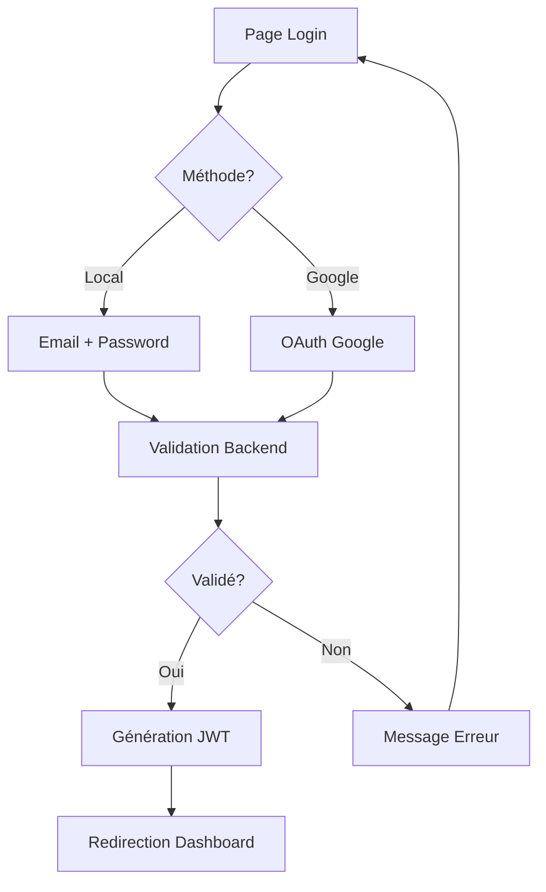

# 📚 Guide Complet des Fonctionnalités

## 🎯 Table des Matières

- [🔐 Authentification](#-authentification)
- [👥 Gestion des Utilisateurs](#-gestion-des-utilisateurs)
- [🛡️ Système de Permissions](#-système-de-permissions)
- [⚙️ Paramètres et Configuration](#️-paramètres-et-configuration)
- [🎨 Personnalisation](#-personnalisation)
- [📊 Dashboard et Analytics](#-dashboard-et-analytics)
- [🔍 Recherche et Filtrage](#-recherche-et-filtrage)
- [📱 Interface Responsive](#-interface-responsive)

---

## 🔐 Authentification

### Méthodes de Connexion

#### 1. Connexion Locale
```bash
URL: http://localhost:3001/login
```
- **Email**: Adresse email valide
- **Mot de passe**: Minimum 8 caractères
- **Validation**: Vérification en temps réel
- **Remember Me**: Session persistante (7 jours)

#### 2. Connexion Google OAuth
```bash
Bouton: "Continuer avec Google"
```
- **Authentification**: Google OAuth 2.0
- **Avantages**: Pas de mot de passe à gérer
- **Sécurité**: Authentification Google sécurisée
- **Profile**: Import automatique du profil Google

### Sécurité

#### JWT Tokens
```typescript
// Access Token (15 minutes)
{
  "userId": 123,
  "email": "user@example.com",
  "role": "user",
  "exp": 1640995200
}

// Refresh Token (30 jours)
{
  "userId": 123,
  "type": "refresh",
  "exp": 1643587200
}
```

#### Protection CSRF
- **SameSite Cookies**: Protection contre les attaques CSRF
- **CORS Configuré**: Origines autorisées uniquement
- **Rate Limiting**: 100 requêtes/15 minutes par IP

### Workflow d'Authentification



---

## 👥 Gestion des Utilisateurs

### Interface Utilisateurs

#### Accès
```bash
Navigation: Sidebar → Utilisateurs
URL: http://localhost:3001/users
Permissions: Admin uniquement
```

#### Fonctionnalités Principales

##### 1. Création d'Utilisateur
```typescript
// Formulaire de création
interface CreateUserForm {
  email: string;           // Unique, requis
  password?: string;       // Optionnel si OAuth
  firstName?: string;      // Optionnel
  lastName?: string;       // Optionnel
  role: 'user' | 'admin';  // Requis
  provider: 'local' | 'google'; // Défaut: local
}
```

**Étapes:**
1. Cliquez sur **"Ajouter un utilisateur"**
2. Remplissez le formulaire
3. Validation en temps réel
4. Cliquez sur **"Créer"**

##### 2. Modification d'Utilisateur
- **Cliquez sur l'icône ✏️** dans la table
- **Modifiez les informations**
- **Validation automatique**
- **Sauvegardez les changements**

##### 3. Suppression d'Utilisateur
- **Cliquez sur l'icône 🗑️**
- **Confirmez la suppression**
- **Vérification des dépendances**
- **Suppression en cascade**

### Table des Utilisateurs

#### Colonnes
| Colonne | Description | Actions |
|---------|-------------|---------|
| Avatar | Image de profil | Upload possible |
| Nom | Prénom + Nom | Triable |
| Email | Adresse email | Triable, unique |
| Rôle | User/Admin | Filtre disponible |
| Créé le | Date de création | Triable |
| Actions | Modifier/Supprimer | Icônes interactives |

#### Fonctionnalités Avancées

##### Recherche
```typescript
// Recherche全文
searchTerm: string = "john@example.com"
// Recherche dans: email, nom, prénom
```

##### Filtres
```typescript
// Filtre par rôle
roleFilter: 'all' | 'admin' | 'user'

// Filtre par date
dateFilter: {
  start: Date;
  end: Date;
}
```

##### Pagination
- **10 utilisateurs par page** (configurable)
- **Navigation fluide** entre pages
- **Info de pagination**: "1-10 sur 50 utilisateurs"

---

## 🛡️ Système de Permissions

### Architecture des Permissions

#### Format des Permissions
```typescript
// Format: action:ressource
interface Permission {
  id: number;
  name: string;        // ex: "create:users"
  description?: string; // Description optionnelle
  createdAt: Date;
  updatedAt: Date;
}
```

#### Actions Disponibles
| Action | Description | Exemple |
|--------|-------------|---------|
| `create` | Créer des ressources | `create:users` |
| `read` | Lire des ressources | `read:products` |
| `update` | Modifier des ressources | `update:orders` |
| `delete` | Supprimer des ressources | `delete:posts` |

#### Ressources Disponibles
| Ressource | Permissions typiques |
|-----------|---------------------|
| `users` | `create:users`, `read:users`, `update:users`, `delete:users` |
| `permissions` | `create:permissions`, `read:permissions`, `update:permissions`, `delete:permissions` |
| `settings` | `read:settings`, `update:settings` |
| `products` | `create:products`, `read:products`, `update:products`, `delete:products` |

### Interface des Permissions

#### Accès
```bash
Navigation: Sidebar → Permissions
URL: http://localhost:3001/settings?tab=permissions
Permissions: Admin uniquement
```

#### Fonctionnalités

##### 1. Création de Permission
```typescript
// Validation du format
const permissionRegex = /^[a-z]+:[a-z]+$/;

// Exemples valides
"create:users"     // ✅ Valide
"read:products"    // ✅ Valide
"invalid-format"   // ❌ Invalide
"CREATE:USERS"     // ❌ Invalide (majuscules)
```

**Étapes:**
1. **Cliquez sur "Ajouter une permission"**
2. **Entrez le nom** (format action:ressource)
3. **Validation en temps réel** avec feedback visuel
4. **Ajoutez une description** (optionnel)
5. **Sauvegardez**

##### 2. Interface Avancée

###### Coloration Syntaxique
```typescript
// Les permissions sont colorées selon l'action
create:users  // Vert (création)
read:products // Bleu (lecture)  
update:orders // Orange (modification)
delete:posts  // Rouge (suppression)
```

###### Filtres Multiples
```typescript
// Filtre par action
filterAction: 'create' | 'read' | 'update' | 'delete'

// Filtre par ressource
filterResource: 'users' | 'products' | 'orders'

// Recherche全文
searchTerm: string
```

###### Sélection Multiple
- **Checkbox master** : Tout sélectionner/désélectionner
- **Sélection individuelle** : Checkbox par ligne
- **Actions groupées** : Suppression en masse (à venir)

##### 3. Copie Rapide
- **Cliquez sur l'icône 📋** pour copier le nom
- **Feedback toast** de confirmation
- **Presse-papiers** automatiquement mis à jour

### Validation et Sécurité

#### Validation en Temps Réel
```typescript
// Messages d'erreur
errors = {
  name: {
    required: "Le nom est requis",
    format: "Format invalide. Utilisez: action:ressource",
    maxLength: "Maximum 50 caractères",
    unique: "Cette permission existe déjà"
  },
  description: {
    maxLength: "Maximum 200 caractères"
  }
}
```

#### Accessibilité
- **ARIA labels** complets
- **Navigation clavier** optimale
- **Contrastes** respectés (WCAG 2.1)
- **Screen reader** compatible

---

## ⚙️ Paramètres et Configuration

### Structure des Settings

#### Accès
```bash
Navigation: Sidebar → Paramètres
URL: http://localhost:3001/settings
```

#### Onglets Disponibles

##### 🌍 Général
```typescript
interface GeneralSettings {
  appName: string;        // Nom de l'application
  appLogo: string;        // URL du logo
  appDescription: string; // Description
  contactEmail: string;   // Email de contact
  version: string;        // Version actuelle
}
```

**Fonctionnalités:**
- **Upload de logo** avec validation
- **Configuration du nom** de l'application
- **Informations de contact**
- **Sauvegarde automatique**

##### 👤 Profil
```typescript
interface UserProfile {
  firstName: string;      // Prénom
  lastName: string;       // Nom
  email: string;          // Email (non modifiable)
  avatar: string;         // URL de l'avatar
  bio?: string;          // Biographie
  phone?: string;        // Téléphone
}
```

**Fonctionnalités:**
- **Upload d'avatar** (JPG, PNG, max 2MB)
- **Informations personnelles**
- **Prévisualisation** en temps réel
- **Validation** des données

##### 🎨 Apparence
```typescript
interface AppearanceSettings {
  theme: 'light' | 'dark' | 'auto';  // Thème
  primaryColor: string;              // Couleur primaire
  accentColor: string;               // Couleur d'accent
  fontSize: 'small' | 'medium' | 'large'; // Taille police
  compactMode: boolean;              // Mode compact
}
```

**Fonctionnalités:**
- **Sélection de thème** avec aperçu
- **Personnalisation des couleurs** avec presets
- **Color picker** avancé
- **Validation hexadécimale** des couleurs
- **Mode compact** optionnel

##### 🔔 Notifications
```typescript
interface NotificationSettings {
  emailNotifications: boolean;     // Notifications email
  pushNotifications: boolean;      // Notifications push
  desktopNotifications: boolean;   // Notifications bureau
  soundEnabled: boolean;           // Sons activés
  frequency: 'immediate' | 'hourly' | 'daily'; // Fréquence
}
```

##### 🔒 Sécurité
```typescript
interface SecuritySettings {
  currentPassword: string;         // Mot de passe actuel
  newPassword: string;             // Nouveau mot de passe
  confirmPassword: string;         // Confirmation
  twoFactorEnabled: boolean;       // 2FA activé
  sessionTimeout: number;          // Timeout session (minutes)
}
```

##### 🛡️ Permissions (Admin)
- **Gestion complète** des permissions
- **Interface avancée** avec filtres
- **Validation en temps réel**
- **Export des permissions**

##### 💾 Système (Admin)
```typescript
interface SystemSettings {
  maintenanceMode: boolean;        // Mode maintenance
  debugMode: boolean;              // Mode debug
  logLevel: 'error' | 'warn' | 'info' | 'debug'; // Niveau logs
  backupFrequency: 'daily' | 'weekly' | 'monthly'; // Fréquence backup
  maxFileSize: number;             // Taille max fichier (MB)
}
```

---

## 🎨 Personnalisation

### Thèmes et Apparence

#### Thèmes Disponibles
```typescript
enum Theme {
  LIGHT = 'light',    // Interface claire
  DARK = 'dark',      // Interface sombre
  AUTO = 'auto'       // Suit le système
}
```

#### Personnalisation des Couleurs

##### Couleurs Principales
```css
:root {
  --primary: #3b82f6;      /* Bleu principal */
  --primary-foreground: #ffffff;
  --accent: #8b5cf6;        /* Violet accent */
  --accent-foreground: #ffffff;
}
```

##### Presets de Couleurs
```typescript
const colorPresets = {
  blue: {
    primary: '#3b82f6',
    accent: '#8b5cf6'
  },
  green: {
    primary: '#10b981', 
    accent: '#059669'
  },
  purple: {
    primary: '#8b5cf6',
    accent: '#7c3aed'
  },
  red: {
    primary: '#ef4444',
    accent: '#dc2626'
  }
};
```

#### Validation des Couleurs
```typescript
// Validation hexadécimale
const hexColorRegex = /^#([A-Fa-f0-9]{6}|[A-Fa-f0-9]{3})$/;

// Couleurs valides
"#3b82f6"  // ✅ Valide
"#fff"     // ✅ Valide  
"#3b82f"   // ❌ Invalide
"blue"     // ❌ Invalide
```

### Aperçu en Temps Réel

#### Panel de Prévisualisation
```typescript
interface PreviewPanel {
  theme: Theme;              // Thème actuel
  primaryColor: string;      // Couleur primaire
  accentColor: string;       // Couleur accent
  showPreview: boolean;      // Afficher l'aperçu
}
```

**Éléments prévisualisés:**
- **Boutons** avec différentes variantes
- **Cards** et composants
- **Textes** et titres
- **Interface** complète

---

## 📊 Dashboard et Analytics

### Tableau de Bord Principal

#### Accès
```bash
URL: http://localhost:3001/dashboard
Permissions: Tous les utilisateurs
```

#### Widgets Disponibles

##### Statistiques Utilisateurs
```typescript
interface UserStats {
  totalUsers: number;        // Total utilisateurs
  activeUsers: number;       // Utilisateurs actifs
  newUsers: number;          // Nouveaux ce mois
  userGrowth: number;        // Croissance (%)
}
```

##### Statistiques des Permissions
```typescript
interface PermissionStats {
  totalPermissions: number;  // Total permissions
  userPermissions: number;   // Permissions utilisateur
  adminPermissions: number;  // Permissions admin
  customPermissions: number; // Permissions personnalisées
}
```

##### Activité Récente
```typescript
interface RecentActivity {
  id: number;
  type: 'user_created' | 'permission_updated' | 'settings_changed';
  description: string;
  timestamp: Date;
  user: string;
}
```

#### Graphiques et Visualisations

##### Graphique de Croissance
- **Type**: Courbe linéaire
- **Période**: 30 derniers jours
- **Métrique**: Nouveaux utilisateurs/jour

##### Répartition des Rôles
- **Type**: Diagramme circulaire
- **Données**: % Admin vs User
- **Interactions**: Clic pour détails

##### Activité par Heure
- **Type**: Histogramme
- **Période**: 24 dernières heures
- **Métrique**: Actions par heure

### Export des Données

#### Formats Disponibles
```typescript
interface ExportOptions {
  format: 'pdf' | 'excel' | 'csv';
  dateRange: {
    start: Date;
    end: Date;
  };
  includeCharts: boolean;
  includeRawData: boolean;
}
```

#### Rapports Automatisés
- **Rapport quotidien**: Email automatique
- **Rapport hebdomadaire**: PDF détaillé
- **Rapport mensuel**: Analyse complète

---

## 🔍 Recherche et Filtrage

### Recherche Globale

#### Fonctionnalités
```typescript
interface SearchConfig {
  query: string;             // Terme de recherche
  scope: 'all' | 'users' | 'permissions' | 'settings';
  fuzzy: boolean;            // Recherche floue
  highlights: boolean;       // Surligner les résultats
}
```

#### Champs de Recherche
- **Users**: Email, nom, prénom, rôle
- **Permissions**: Nom, description
- **Settings**: Nom, description, valeur

### Filtres Avancés

#### Filtres par Date
```typescript
interface DateFilter {
  field: 'createdAt' | 'updatedAt' | 'lastLogin';
  operator: 'eq' | 'gt' | 'lt' | 'between';
  value: Date | DateRange;
}
```

#### Filtres par Statut
```typescript
interface StatusFilter {
  users: 'active' | 'inactive' | 'all';
  permissions: 'enabled' | 'disabled' | 'all';
  settings: 'modified' | 'default' | 'all';
}
```

### Sauvegarde des Filtres

#### Presets de Filtres
```typescript
interface FilterPreset {
  id: string;
  name: string;
  filters: FilterConfig[];
  isDefault: boolean;
  createdBy: string;
}
```

**Exemples de presets:**
- **"Utilisateurs actifs récents"**
- **"Permissions système"**  
- **"Settings modifiés ce mois"**

---

## 📱 Interface Responsive

### Adaptation par Écran

#### Desktop (≥1024px)
```css
.dashboard {
  display: grid;
  grid-template-columns: 250px 1fr;
  gap: 2rem;
}
```

#### Tablet (768px - 1023px)
```css
.dashboard {
  grid-template-columns: 1fr;
  padding: 1rem;
}
```

#### Mobile (<768px)
```css
.dashboard {
  padding: 0.5rem;
}
.sidebar {
  transform: translateX(-100%);
}
```

### Navigation Mobile

#### Menu Hamburger
- **Icône**: ☰ en haut à gauche
- **Animation**: Slide-in/out
- **Overlay**: Fond semi-transparent
- **Swipe**: Support swipe pour fermer

#### Touch Optimized
- **Boutons**: Minimum 44px de hauteur
- **Espacement**: Suffisant entre éléments
- **Scroll**: Horizontal pour les tables
- **Zoom**: Pinch-to-zoom supporté

### Performance Mobile

#### Optimisations
- **Lazy loading** des images
- **Code splitting** par route
- **Service Worker** pour cache
- **Compression** des assets

#### Mesures de Performance
- **First Contentful Paint**: <1.5s
- **Largest Contentful Paint**: <2.5s
- **Cumulative Layout Shift**: <0.1
- **First Input Delay**: <100ms

---

## 🎯 Bonnes Pratiques d'Utilisation

### Règles de Sécurité

#### Mot de Passe
```typescript
// Exigences de sécurité
const passwordRequirements = {
  minLength: 8,
  requireUppercase: true,
  requireLowercase: true,
  requireNumbers: true,
  requireSpecialChars: true,
  preventCommonPasswords: true
};
```

#### Permissions
- **Principe du moindre privilège**
- **Audit régulier** des permissions
- **Révocation automatique** des comptes inactifs
- **Logging** des actions sensibles

### Recommandations

#### Pour les Administrateurs
1. **Vérifiez régulièrement** les permissions
2. **Surveillez l'activité** des utilisateurs
3. **Maintenez les settings** à jour
4. **Faites des backups** réguliers

#### Pour les Utilisateurs
1. **Utilisez des mots de passe forts**
2. **Activez 2FA** si disponible
3. **Personnalisez votre profil**
4. **Signalez les activités suspectes**

---

## 🚀 Évolutions Futures

### Fonctionnalités en Développement

#### Permissions Avancées
- **Héritage de rôles**
- **Permissions temporelles**
- **Workflow d'approbation**
- **Audit trail complet**

#### Dashboard Étendu
- **Widgets personnalisables**
- **Export automatisé**
- **Alertes en temps réel**
- **Intégrations tierces**

#### Mobile App
- **Application native** iOS/Android
- **Notifications push**
- **Mode hors-ligne**
- **Synchronisation** automatique

---

**🎯 Ce guide couvre l'ensemble des fonctionnalités disponibles dans Projet-0. Pour toute question ou pour signaler un problème, n'hésitez pas à consulter la documentation technique ou à contacter l'équipe de développement.**
